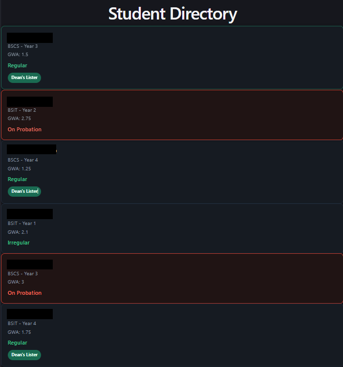

# Student Directory

A static, styled Student Directory built for **CCS112 — Application Development and Emerging Technologies** (Week 7 Lab: Components, Props & CSS Styling).

This project renders a fixed list of students as styled cards using React functional components, props, and CSS Modules — no hooks, no state, no backend.

## Preview

